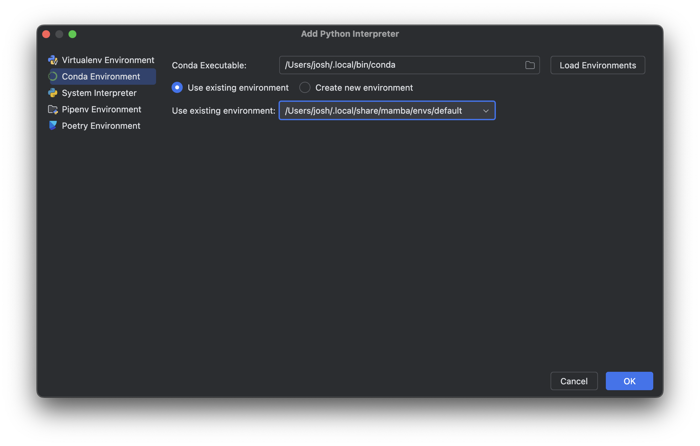

This is a simple shim script to wrap `micromamba` for use with [PyCharm](https://www.jetbrains.com/pycharm/), which otherwise doesn't recognize [mamba](https://github.com/mamba-org/mamba) as a valid [conda](https://github.com/conda/conda) executable. To use:

1. Confirm the shim's `EXECUTABLE_PATH` is the full path to your `micromamba` executable.
2. Confirm the shim is executable (i.e. `chmod u+x ./conda`).
3. In **PyCharm Settings** -> **Python Interpreter** -> **Add Interpreter**, add a new 
   Conda Environment with the shim set as the Conda Executable.

